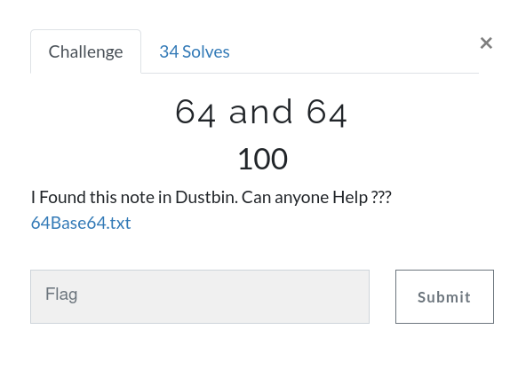

# 64 and 64



Challenge: [64Base64.txt](https://github.com/an0n4ce/CTF-Write-Ups/raw/master/Gravithon-CTF-21/64-and-64/img/64Base64.txt)

it's a 38 times `base64` encoded string, Decode to get your flag.

```
gravithon{l00ks_l1ke_4_l0t_0f_64s}
```
