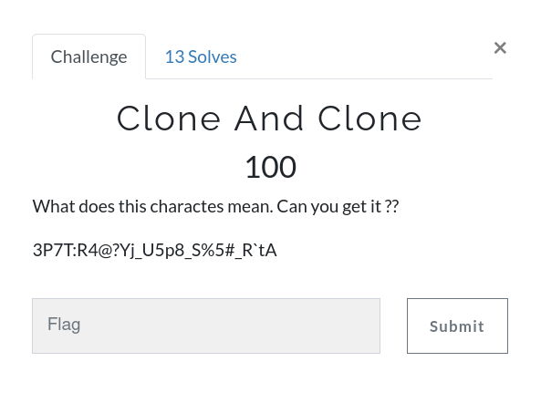
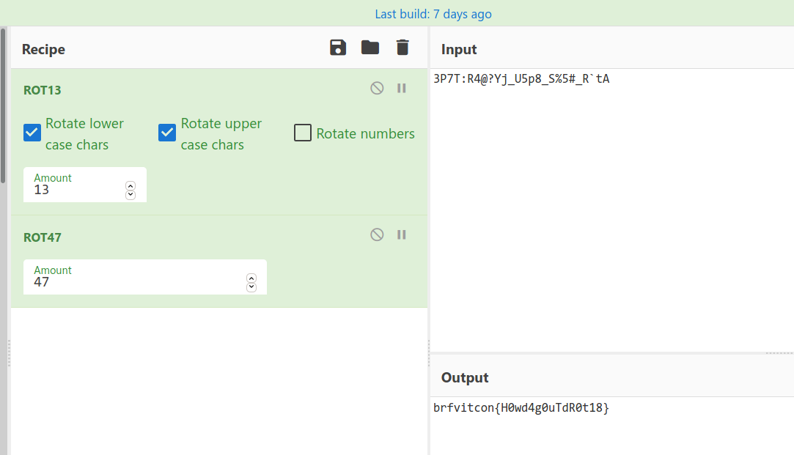

# Clone And Clone



Challenge:
```
3P7T:R4@?Yj_U5p8_S%5#_R`tA
```
It looks like a `ROT47` string, When we do `ROT13` and `ROT47` we, get our flag like this ` brfvitcon{H0wd4g0uTdR0t18} `.



The flag has 3 words, first and last is set for us. what i done here guessed the middle word. that is `H0w_4b0uT_R0t18`

```
gravithon{H0w_4b0uT_R0t18}
```
