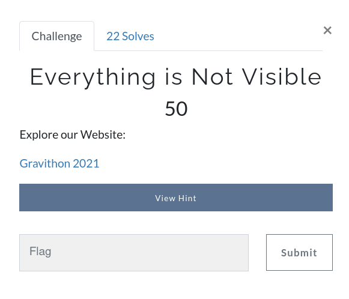
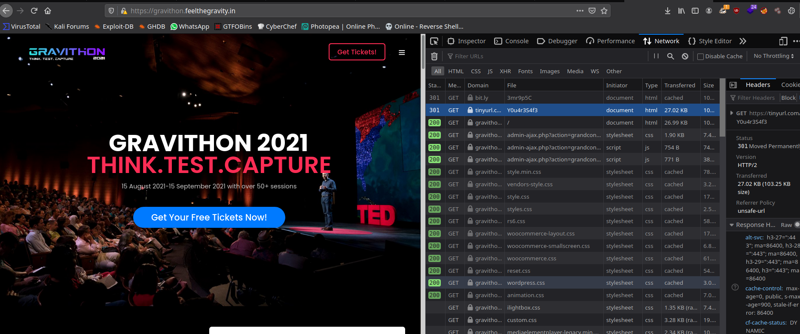

# Everything is Not Visible



Here the given link was https://bit.ly/3mr9p5C , With help of Browser's `Network Monitor` Tab, you can see the all contents that loading, and it is double shorted URL, that is `bit.ly` and `tinyurl` from the name of that url we get our flag.



```
gravithon{Y0u4r3S4f3}
```
