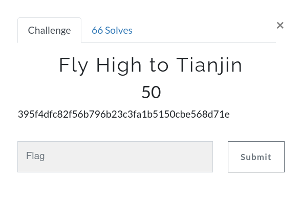
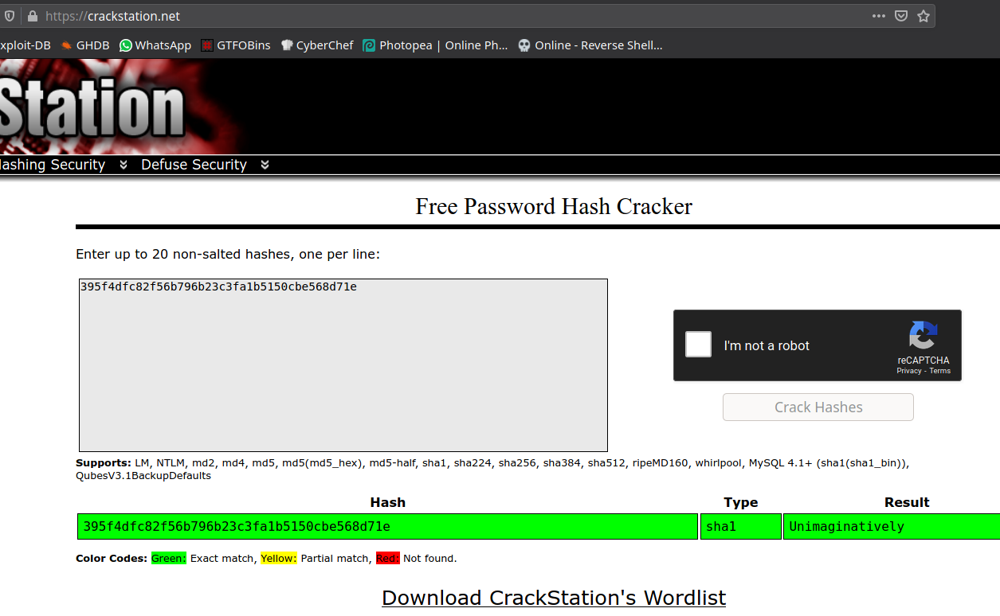

# Fly High to Tianjin



Challenge:
```
395f4dfc82f56b796b23c3fa1b5150cbe568d71e
```

It's a `SHA1` hashing algorithm. I used [CrackStation](https://crackstation.net/) to crack the hash.



```
gravithon{Unimaginatively}
```
