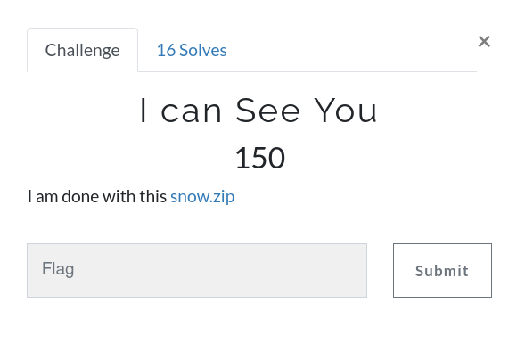
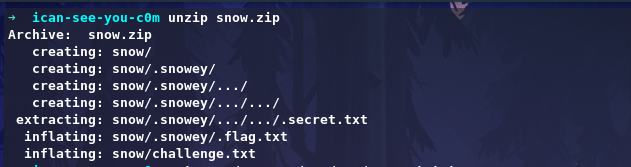
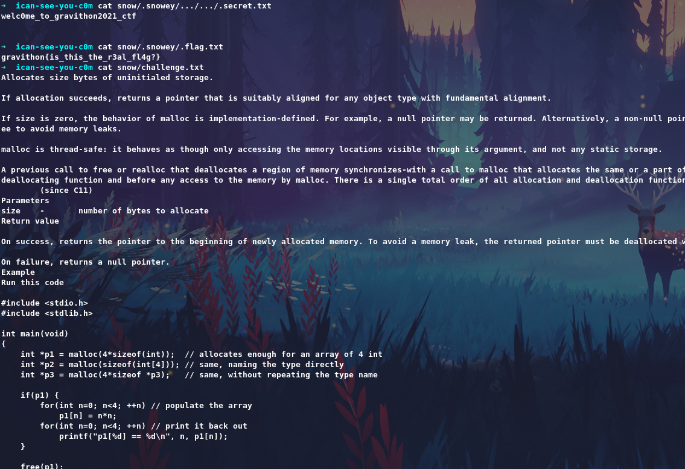

# I can See You



Challenge: [snow.zip](https://github.com/an0n4ce/CTF-Write-Ups/raw/master/Gravithon-CTF-21/I-can-See-You/img/snow.zip)

From the given file name `snow.zip` we know it's a `snow tool` challenge. Here i used [stegsnow](http://manpages.ubuntu.com/manpages/bionic/man1/stegsnow.1.html) to get the flag.

stegsnow is a program for concealing messages in text files by appending tabs  and  spaces on  the  end  of lines, and for extracting messages from files containing hidden messages. Tabs and spaces are invisible to most text viewers, hence  the  steganographic  nature  of this encoding scheme.



After extarcting the file we get 3 more files, There is a fake flag, and our challange, and passwd that is in `.secret.txt`



Use `stegsnow` to get the flag and give passwd as `welc0me_to_gravithon2021_ctf` from `.secret.txt`

```
stegsnow -C -Q -p welc0me_to_gravithon2021_ctf snow/challenge.txt

```


```
gravithon{i5_it_c0ld_ov3r_th3re}
```
