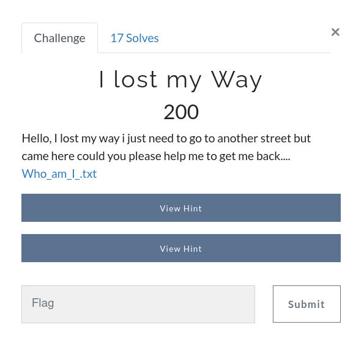
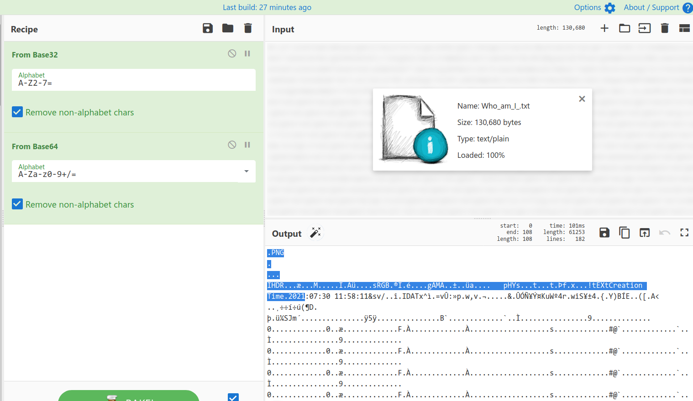

# I lost my Way



Challenge: [Who_am_I_.txt](https://github.com/an0n4ce/CTF-Write-Ups/blob/master/Gravithon-CTF-21/I-lost-my-Way/img/Who_am_I_.txt)

It's multiple encoded text file that is `base32` and `base64`. 



That is a `PNG` image file [download](https://github.com/an0n4ce/CTF-Write-Ups/raw/master/Gravithon-CTF-21/I-lost-my-Way/img/download.png) it and open to get your flag. Wrap it in all Capital letters as per the instruction.

```
gravithon{F1N4LLY_Y0U_CR34T3D_B34UT1FUL_IM4G3}
```
