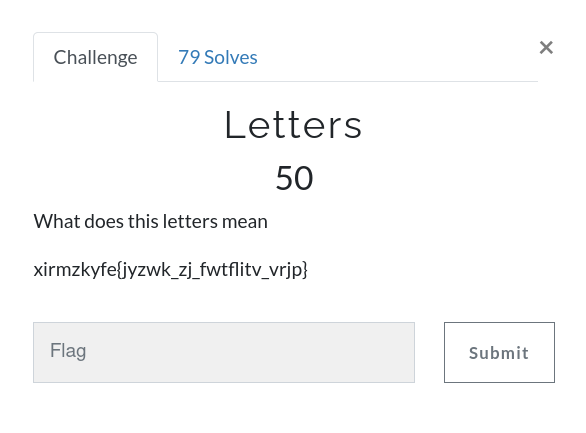
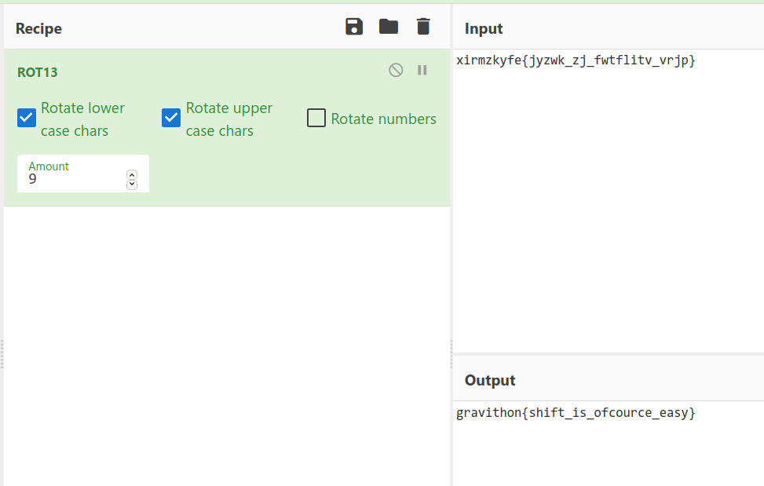

# Letters



Challenge:
```
xirmzkyfe{jyzwk_zj_fwtflitv_vrjp}
```

It's `ROT9` cipher, [Decode](https://gchq.github.io/CyberChef/#recipe=ROT13(true,true,false,9)&input=eGlybXpreWZle2p5endrX3pqX2Z3dGZsaXR2X3ZyanB9) and get the flag.



```
gravithon{shift_is_ofcource_easy}
```
