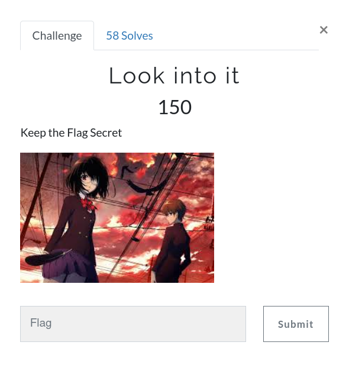
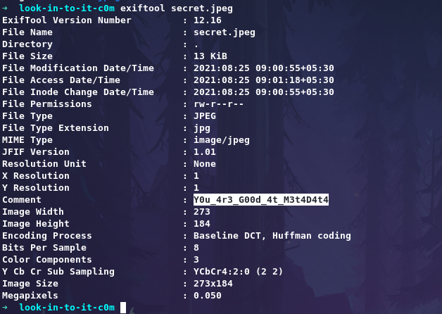

# Look into it



Challenge: [secret.jpeg](https://github.com/an0n4ce/CTF-Write-Ups/raw/master/Gravithon-CTF-21/Look-into-it/img/secret.jpeg)

Use `exiftool` to get your flag.
```
exiftool secret.jpeg
```


```
gravithon{Y0u_4r3_G00d_4t_M3t4D4t4}
```
