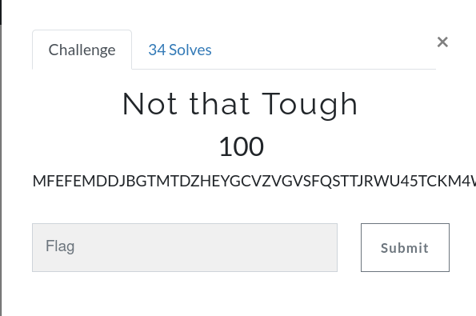
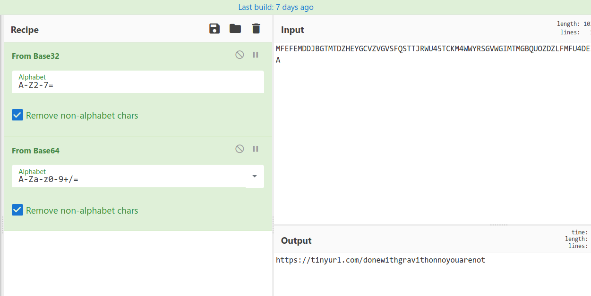
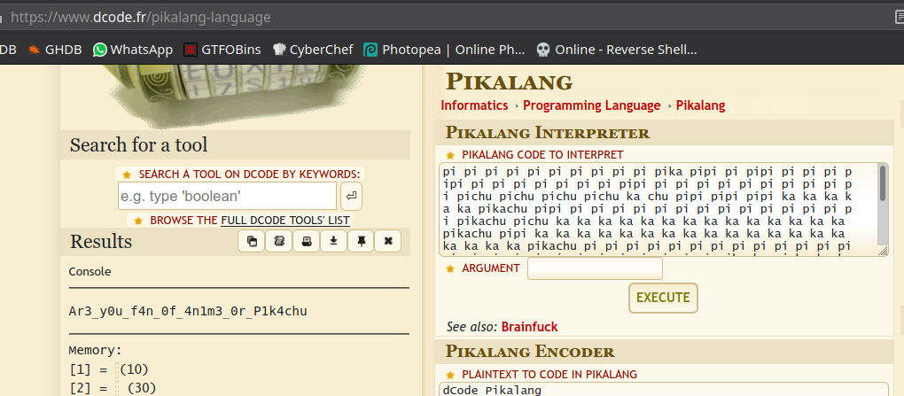

# Not that Tough



Challenge:
```
MFEFEMDDJBGTMTDZHEYGCVZVGVSFQSTTJRWU45TCKM4WWYRSGVWGIMTMGBQUOZDZLFMFU4DEI5UHMYTNGV3GKVZZGFMVQSTMMJWTSMA
```
It's multiple encoded string, that is first `Base32` then `Base64`, gives a shorted url ` https://tinyurl.com/donewithgravithonnoyouarenot `



the link going for another encoded cipher that is `Pikalang`, 

```
pi pi pi pi pi pi pi pi pi pi pika pipi pi pipi pi pi pi pipi pi pi pi pi pi pi pi pipi pi pi pi pi pi pi pi pi pi pi pichu pichu pichu pichu ka chu pipi pipi pipi ka ka ka ka ka pikachu pipi pi pi pi pi pi pi pi pi pi pi pi pi pi pi pikachu pichu ka ka ka ka ka ka ka ka ka ka ka ka ka ka pikachu pipi ka ka ka ka ka ka ka ka ka ka ka ka ka ka ka ka ka ka ka pikachu pi pi pi pi pi pi pi pi pi pi pi pi pi pi pi pi pi pi pi pi pi pi pi pi pi pi pikachu pichu ka ka ka pikachu pipi ka ka ka ka pikachu ka ka ka ka ka ka ka ka ka ka ka ka ka ka ka ka ka ka ka ka ka ka pikachu pi pi pi pi pi pi pi pikachu pichu pi pi pi pi pikachu pipi pi pi pi pi pi pi pi pi pikachu ka ka ka ka ka ka ka ka ka ka ka ka ka ka ka pikachu pichu ka ka ka ka pikachu pipi pi pi pi pi pi pi pi pikachu ka ka ka ka ka ka ka pikachu pichu pi pi pi pi pikachu pipi pi pi pi pi pi pi pi pi pi pi pi pi pi pi pi pikachu pichu ka ka ka pikachu pipi ka pikachu pichu pi pi pikachu pipi ka ka ka ka ka ka ka ka ka ka ka ka ka ka pikachu pichu ka ka ka pikachu pipi pi pi pi pi pi pi pi pi pi pi pi pi pi pi pi pi pi pi pi pikachu ka ka ka ka ka ka ka ka ka ka ka ka ka ka ka ka ka ka ka pikachu ka ka ka ka ka ka ka ka ka ka ka ka ka ka ka pikachu pichu pi pikachu pipi pi pi pi pi pi pi pi pi pi pi pi pi pi pi pi pi pi pi pi pi pi pi pi pi pi pi pi pikachu pichu pi pi pi pikachu pipi ka ka ka ka ka ka ka ka pikachu pi pi pi pi pi pikachu pi pi pi pi pi pi pi pi pi pi pi pi pi pikachu 
```
[Decode](https://www.dcode.fr/pikalang-language) to get our flag.



```
gravithon{Ar3_y0u_f4n_0f_4n1m3_0r_P1k4chu}
```
