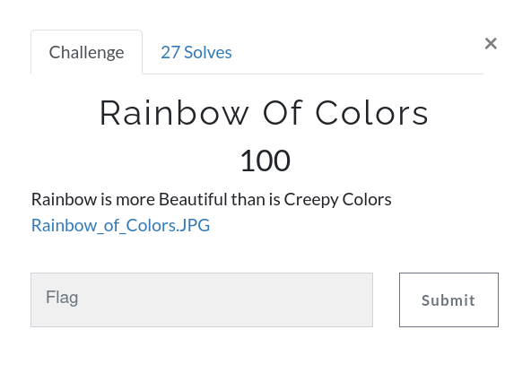
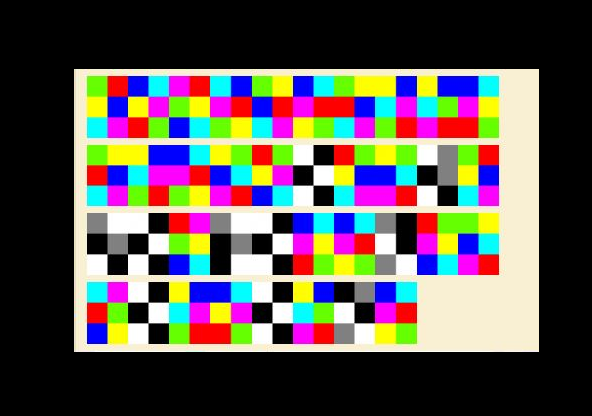

# Rainbow Of Colors



Challenge: [Rainbow_of_Colors.JPG](https://github.com/an0n4ce/CTF-Write-Ups/raw/master/Gravithon-CTF-21/Rainbow-Of-Colors/img/Rainbow_of_Colors.JPG)



The challenge is about `Hexahue Cipher`. [Decode](https://www.dcode.fr/hexahue-cipher) and get your flag.

```
gravithon{should,fl5g4,b3,st1cky,or,n0t}
```
