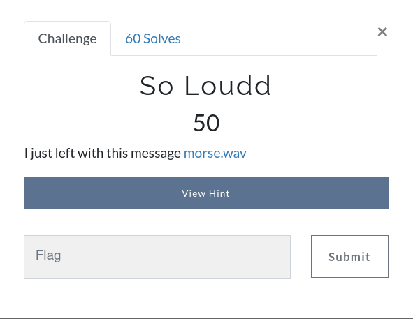
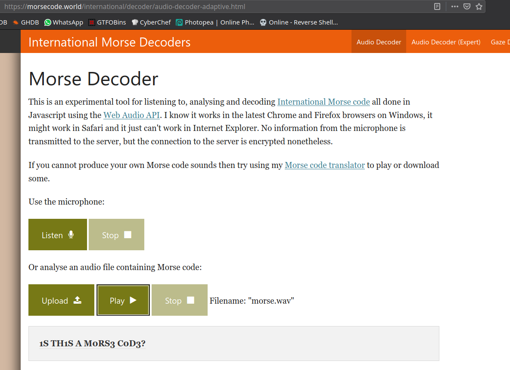

# So Loudd



Challenge: [morse.wav]()

It's a `Morse Code` audio, We can use [Morse Decoder](https://morsecode.world/international/decoder/audio-decoder-adaptive.html) to get the flag, Upload and play the audio.
The decrypted message will be our flag.



```
gravithon{1S TH1S A M0RS3 C0D3?}
```
