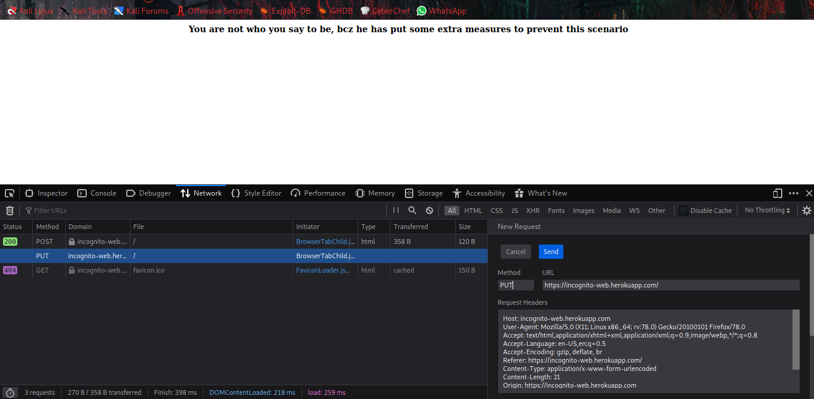

## Simple Login


*[here is the challenge](https://incognito-web.herokuapp.com/)*

**Hint**


In the hint we can easily predict username and password, `admin:admin` also `PUT` method.

After logged in you can see, 
*"You are not who you say to be, bcz he has put some extra measures to prevent this scenario"*


Open `Network Monitor` from your browser, get the request by refreshing the page


Edit and Resend the request with `PUT` method.





Go to responce tab, there will be the flag.


```flag = ICTF{N0T_S0_S3Cur3d_853541}```


