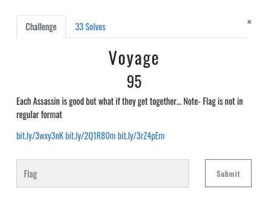
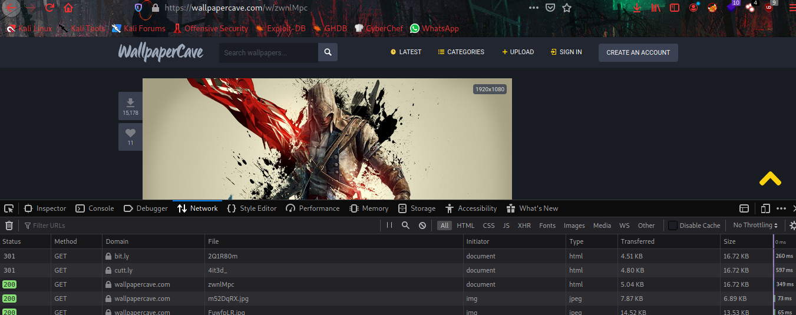

# Voyage





Here is the 3 links     


When we redirecting to Assassins Wallpaper, actually there is two redirection going on,
you can see that with `Network Monitor` from your browser.


here you can see `cutt.ly` domain with file name `Cl1ckB` note that, and look 2 other wallpapers cutt.ly domain with file names,





Once you got all file name, `4it3d_` , `Ass4ss1n` as per the challenge says get it together
You will find the flag.


```flag = ICTF{Cl1ckb4it3d_Ass4ssin}```
