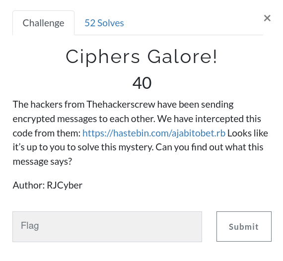
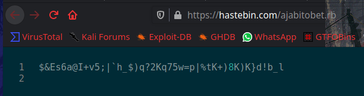
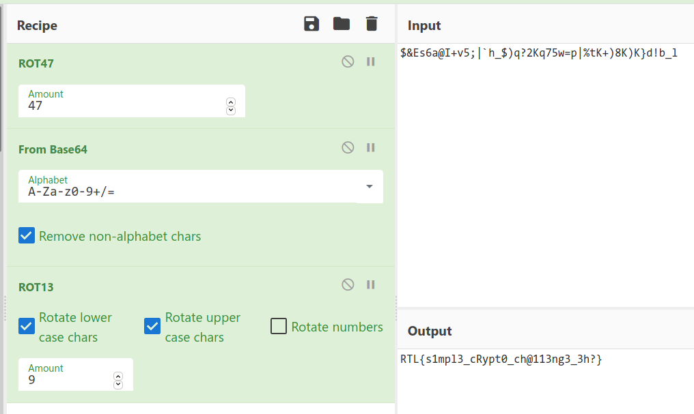

# Ciphers Galore!



Challenge [Link](https://hastebin.com/ajabitobet.rb)



```
$&Es6a@I+v5;|`h_$)q?2Kq75w=p|%tK+)8K)K}d!b_l
```

The flag is encoded 3 times! 

`ROT 47 > Base64 > ROT 9`



``` RTL{s1mpl3_cRypt0_ch@113ng3_3h?} ```
