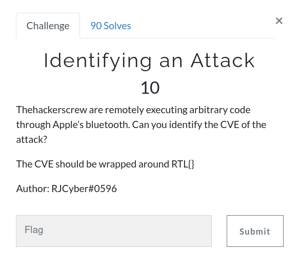
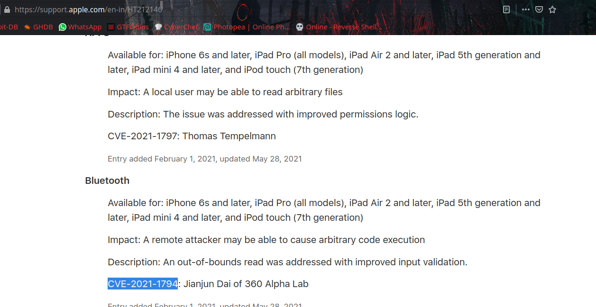

# Identifying an Attack



So the challenge is we need to find the CVE of remotely executing arbitrary code through Apple’s bluetooth.

We can get flag with help of googling. here is [reference](https://support.apple.com/en-in/HT212146)



```
RTL{CVE-2021-1794}
```
