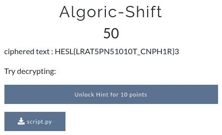

# Algoric-Shift



script.py:
```
text = 'flag{...}'

key = [3,1,2]

li0 = []
li1 = []
li2 = []
for i in range(0,len(text)):
    if i % 3 == 0:
        li0.append(text[i])
    elif (i - 1) % 3 == 0:
        li1.append(text[i])
    elif (i - 2) % 3 == 0:
        li2.append(text[i])
li = []
for i in range(len(li1)): 
    li.append(li1[i]) 
    li.append(li2[i])
    li.append(li0[i])

# print(li)
print("The ciphered text is :")
ciphered_txt = (''.join(li))
print(ciphered_txt)
```
I given the solution for solving

```
text = 'HESL{LRAT5PN51010T_CNPH1R}3'
key = [3,1,2]

li0 = []
li1 = []
li2 = []
for i in range(0,len(text)):
    if i % 3 == 0: # as the length of the cipher is 3
        li0.append(text[i])
    elif (i - 1) % 3 == 0:
        li1.append(text[i])
    elif (i - 2) % 3 == 0:
        li2.append(text[i])
li = []
for i in range(len(li1)): # here as the length of the text is 27 and it is divisble by 3
    li.append(li2[i]) # setting the order back to get the deciphered text.
    li.append(li0[i])
    li.append(li1[i])

deciphered_txt = ''.join(li)
print("the deciphered text is :")
print(deciphered_txt)
```

```SHELL{TRAN5P051T10N_C1PH3R}```
