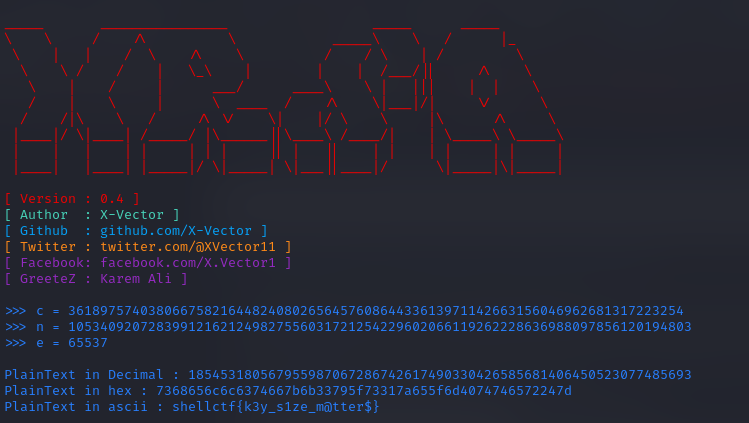

# Bruteforce RSA

Here given some info.

* flag format
```
Flag Format : shellctf{}
```

* python script:
```py
from Crypto.Util.number import bytes_to_long,inverse,getPrime,long_to_bytes
from secret import message
import json

p = getPrime(128)
q = getPrime(128)

n = p * q
e = 65537 

enc = pow(bytes_to_long(message.encode()),e,n)
print("Encrypted Flag is {}".format(enc))

open('./values.json','w').write(json.dumps({"e":e,"n":n,"enc_msg":enc}))
```

* values.json
```json
{"e": 65537, "n": 105340920728399121621249827556031721254229602066119262228636988097856120194803, "enc_msg": 36189757403806675821644824080265645760864433613971142663156046962681317223254}

```
I used [X-RSA](https://github.com/X-Vector/X-RSA) tool to decrypt.



```shellctf{k3y_s1ze_m@tter$}```
