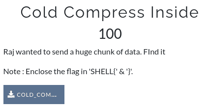
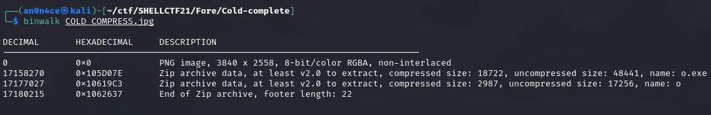
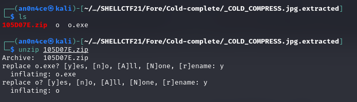
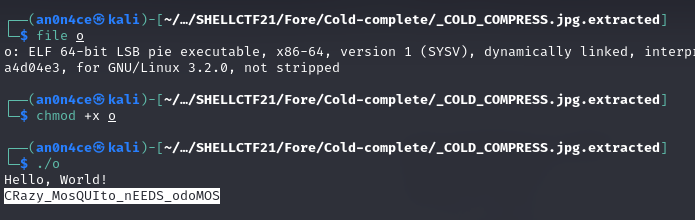

# Cold Compress Inside



Let's do `bimwalk` on given file.



There is zip archived file, extract with `-e` command.



Once we `unzip` the file it give us `o` named `LSB pie executable` file. run the programme to get the flag.



```SHELL{CRazy_MosQUIto_nEEDS_odoMOS}```
