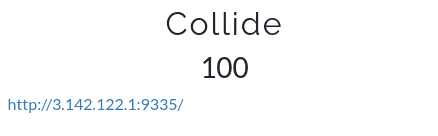
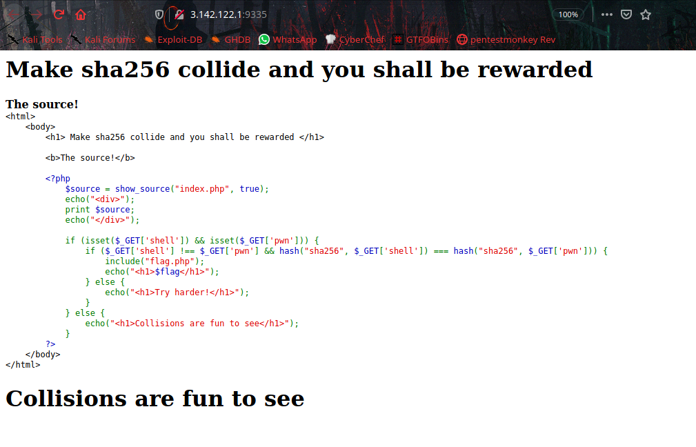
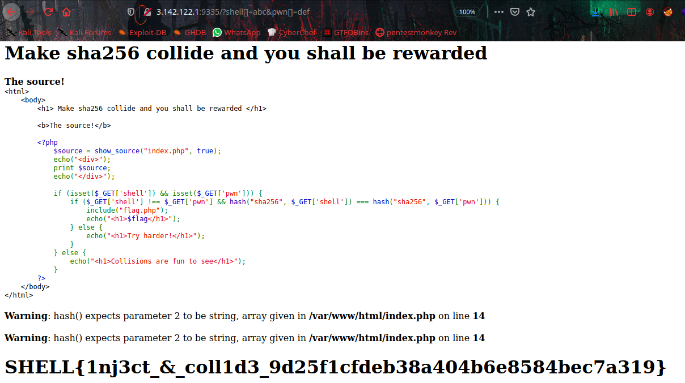

# Collide



Challenge [Link](http://3.142.122.1:9335/)
There is php code, to get the flag.



From the source code, We know that there is two parameters called `shell` and `pwn`. Also it has different values. To get our flag by crashing the execution of both `hash()` calls and you need to send `shell` and `pwn` as an arrays.

 


```SHELL{1nj3ct_&_coll1d3_9d25f1cfdeb38a404b6e8584bec7a319}```
