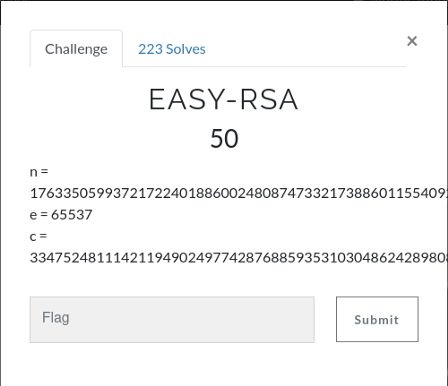
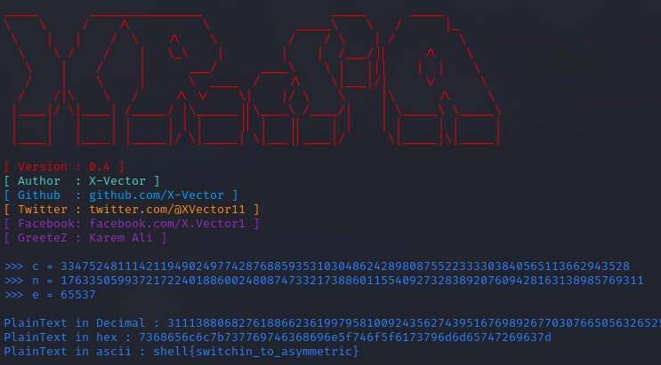

# EASY-RSA



```
n = 1763350599372172240188600248087473321738860115540927328389207609428163138985769311
e = 65537
c = 33475248111421194902497742876885935310304862428980875522333303840565113662943528
```
here i used [X-RSA](https://github.com/X-Vector/X-RSA) tool to decryption.



```shell{switchin_to_asymmetric}```
