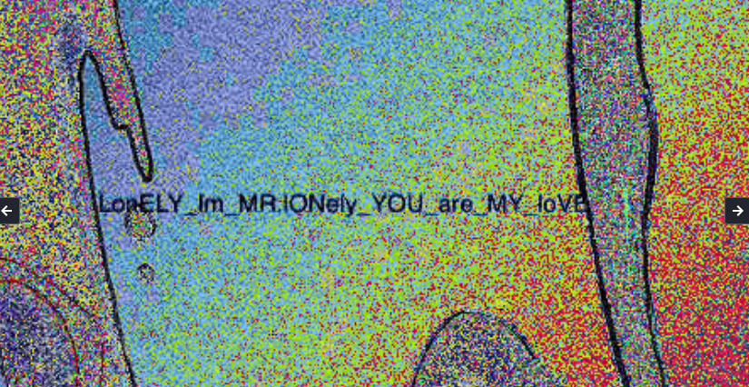

# Grass Is Green

Here we get `[grass_is_green.jpg](img/grass_is_green.jpg)`

i used [stegonline.georgeom.net](https://stegonline.georgeom.net/upload) website. and go for LSB half view , from top left corner have flag.



```SHELL{LonELY_Im_MR.lONely_YOU_are_MY_LoVE}```
