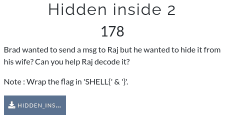
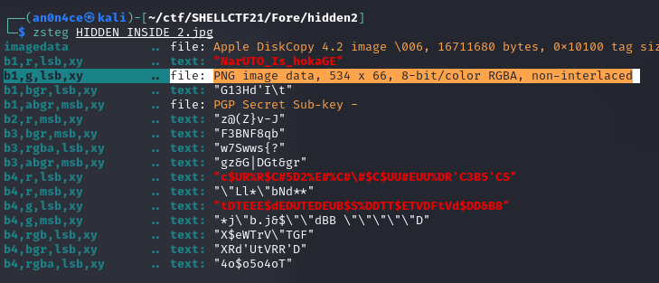

# Hidden inside 2



It's also a `.png` file. So i used `zsteg` here.



`zsteg` found a hidden `PNG` file on `b1,g,lsb,xy`. Let's extract it using `-E` option, and open the picture to get flag.

`zsteg -E b1,g,lsb,xy HIDDEN_INSIDE_2.jpg > flag.png` 


```SHELL{RayMONd_redDINTON_is_nOt_iLLYA}```
