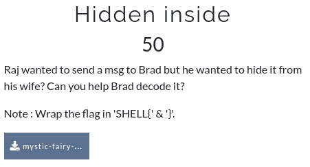
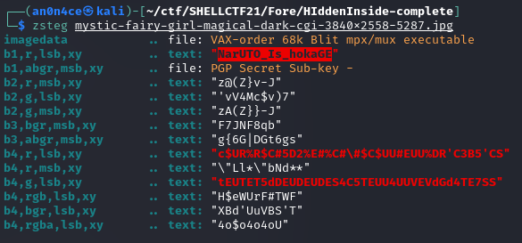

# Hidden inside



Here we get file `mystic-fairy-girl-magical-dark-cgi-3840x2558-5287.jpg`.

Extension is `jpg` here but `file` command gives its a `.png` file so we can use `zsteg` to look something encoded inside.



```SHELL{NarUTO_Is_hokaGE}```
