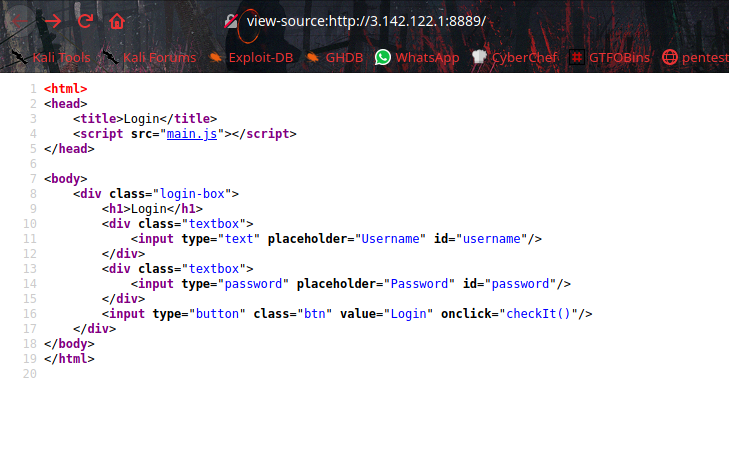

# Login


Challenge [Link](http://3.142.122.1:8889/)

There is a login Portal.


I put `admin::admin` as username:password, they showing `Only for user: din_djarin11`. we got username.


Let's check the source code.



From the soucecode we know there is a function called `checkIt()` also source is from `main.js`. let's check it.


In the source code we get `MD5` hashed password string `9ef71a8cd681a813cfd377817e9a08e5`. Let's crack it here i used [crackstation](https://crackstation.net/) website.


So we got username and password that is `din_djarin11::ir0nm4n`. Once we login we get a file to download named `ir0nm4n`, we get our from that file.


```SHELL{th1s_i5_th3_wa7_845ad42f4480104b698c1e168d29b739}```
