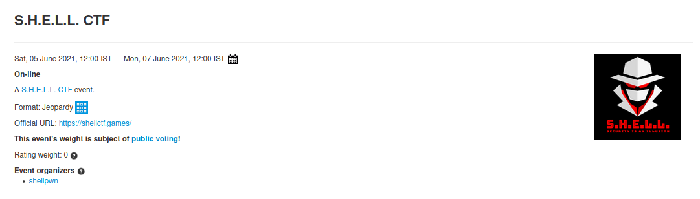

# Challenges

## Web

* [anonym](https://github.com/an0n4ce/CTF-Write-Ups/blob/master/SHELL-CTF-21/anonym/README.md)
* [Login](https://github.com/an0n4ce/CTF-Write-Ups/tree/master/SHELL-CTF-21/Login/README.md)
* [Collide](https://github.com/an0n4ce/CTF-Write-Ups/tree/master/SHELL-CTF-21/Collide/README.md)
* [Under Development](https://github.com/an0n4ce/CTF-Write-Ups/tree/master/SHELL-CTF-21/Under%20Development/README.md)
* [Fun with Tokens](https://github.com/an0n4ce/CTF-Write-Ups/tree/master/SHELL-CTF-21/Fun-With-Token/README.md)

## Forensic

* [Hidden inside](https://github.com/an0n4ce/CTF-Write-Ups/tree/master/SHELL-CTF-21/Hidden-inside/README.md)
* [Cold Compress Inside](https://github.com/an0n4ce/CTF-Write-Ups/tree/master/SHELL-CTF-21/Cold-Compress-Inside/README.md)
* [Hidden inside 2](https://github.com/an0n4ce/CTF-Write-Ups/tree/master/SHELL-CTF-21/Hidden-inside-2/README.md)
* [Grass is green](https://github.com/an0n4ce/CTF-Write-Ups/tree/master/SHELL-CTF-21/Grass-is-green/README.md)

## Cryptography

* [encoder](https://github.com/an0n4ce/CTF-Write-Ups/tree/master/SHELL-CTF-21/encoder/README.md)
* [EASY_RSA](https://github.com/an0n4ce/CTF-Write-Ups/tree/master/SHELL-CTF-21/EASY-RSA/README.md)
* [Algoric-Shift](https://github.com/an0n4ce/CTF-Write-Ups/tree/master/SHELL-CTF-21/Algoric-Shift/README.md)
* [Subsi](https://github.com/an0n4ce/CTF-Write-Ups/tree/master/SHELL-CTF-21/Algoric-Shift/README.md)
* [haxxor](https://github.com/an0n4ce/CTF-Write-Ups/tree/master/SHELL-CTF-21/haxxor/README.md)
* [cjk](https://github.com/an0n4ce/CTF-Write-Ups/tree/master/SHELL-CTF-21/cjk/README.md)
* [Bruteforce RSA](https://github.com/an0n4ce/CTF-Write-Ups/tree/master/SHELL-CTF-21/Bruteforce-RSA/README.md)
