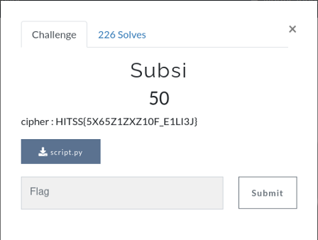

# Subsi



encrypted flag:
```
HITSS{5X65Z1ZXZ10F_E1LI3J}
```

script.py:
```

alpha = 'ABCDEFGHIJKLMNOPQRSTUVWXYZ{}_1234567890'
key   = 'QWERTPOIUYASDFGLKJHZXCVMNB{}_1234567890'

text = 'SHELL{5U65T1TUT10N_C1PH3R}'

def encrypter(text,key):
    encrypted_msg = ''
    for i in text:
        index = alpha.index(i)
        encrypted_msg += key[index]
    # print(encrypted_msg)
    return encrypted_msg

enc_msg = encrypter(text,key)
print(encrypter(text,key))

def decrypter(encyrptedMsg, key):
    decrypted_msg = ''
    for i in encyrptedMsg:
        index = key.index(i)
        decrypted_msg += alpha[index]
    return decrypted_msg

print(decrypter(enc_msg,key))
```
It's Alphabetical substitution cipher. I used [cryptii.com](https://cryptii.com/pipes/alphabetical-substitution) to decrypt. change `PLAINTEXT ALPHABET` to give alpha string `ABCDEFGHIJKLMNOPQRSTUVWXYZ{}_1234567890` and `CIPHERTEXT ALPHABET` to key string `QWERTPOIUYASDFGLKJHZXCVMNB{}_1234567890` to get the flag.


```SHELL{5U65T1TUT10N_C1PH3R}```
