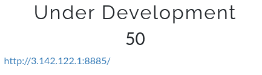
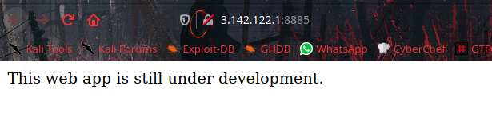
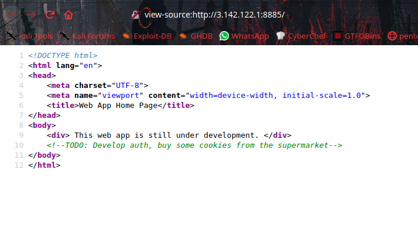
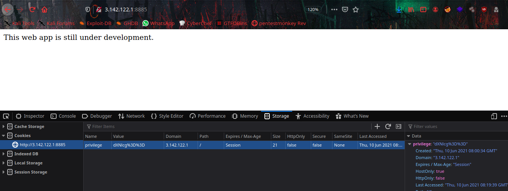
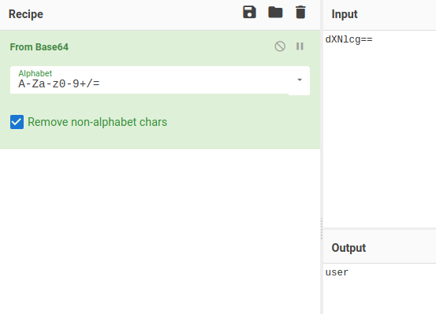
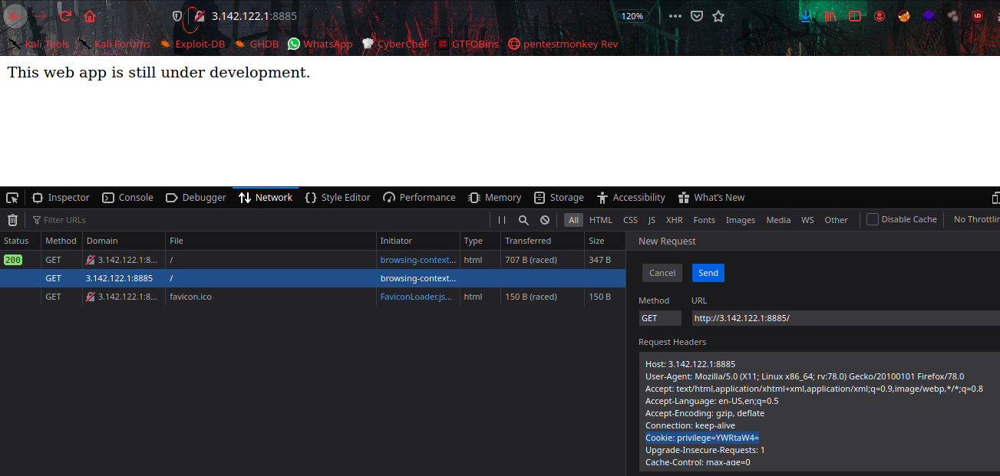
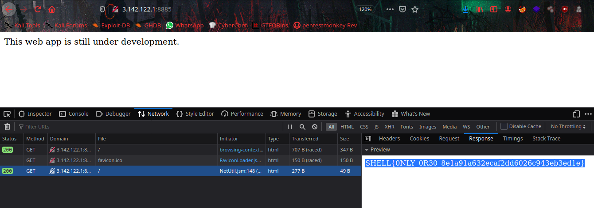

# Under Development



Challenge [Link](http://3.142.122.1:8885/)



Let's check the source.



They are saying about cookie, there is a session cookie named `privilege` is storing.



It's base64 encoded string, once we decoded we get `user`



What i did here, encoded `admin` to base64 string, that is `YWRtaW4=`. Because admin has more privilege than user.


So let's edit and send the request using browser `Network Monitor`.
change cookie value to base64 encoded string of `admin`.



From the responce tab we will get our flag.



```SHELL{0NLY_0R30_8e1a91a632ecaf2dd6026c943eb3ed1e}```
