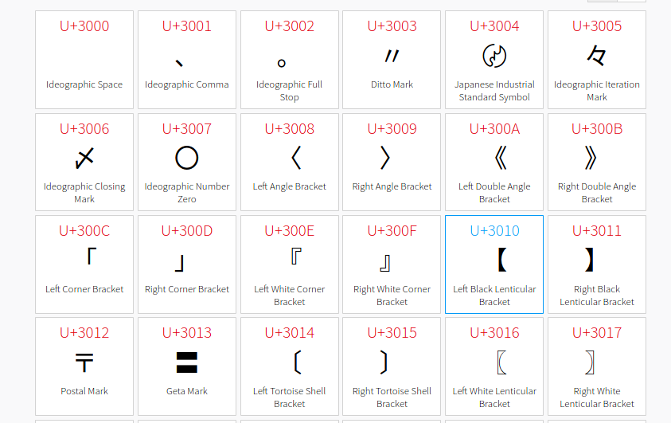

# cjk


Here given a png file to Find the PIN.

It's Unicode Block “CJK Symbols and Punctuation” here is the [reference](https://www.compart.com/en/unicode/block/U+3000). 



We need to find the sum of the values, `3036+3004+3013` = `9053`

```SHELL{9053}```
