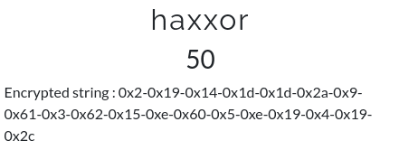
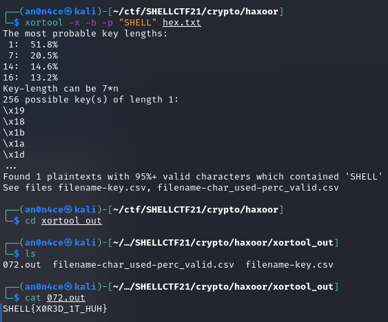

# haxxor



```
Encrypted string : 0x2-0x19-0x14-0x1d-0x1d-0x2a-0x9-0x61-0x3-0x62-0x15-0xe-0x60-0x5-0xe-0x19-0x4-0x19-0x2c
```

Here i used [xortool](https://pypi.org/project/xortool/0.95/) to get the flag.



```SHELL{X0R3D_1T_HUH}```
