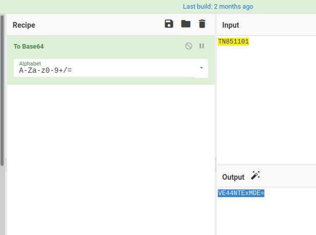

# Akka University


Going through webpage, there is a `Download Now` button to get Exam question papers,


When checking every picture they give, 


There is something interesting about url, The base64 encoded string of every question paper name displaying on url path to get the *.png* image file




And the last Question paper doesn't giving any Picture, So i encoded `TN851105` string to base64 that is,  `VE44NTExMDU=`


And put it in url path `http://143.110.246.109:8000/img/VE44NTExMDU=.png` they give the picture


So they saying `Try to view-source in different way`, I paste the url on Chromium web browser, `view-source:http://143.110.246.109:8000/img/VE44NTExMDU=.png`


We can see there is base64 encoded string in the bottom, decode it to get the flag.


```flag = TamilCTF{Ju5T_4PPly_R3_Ev4lu4T10N}```
