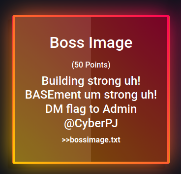
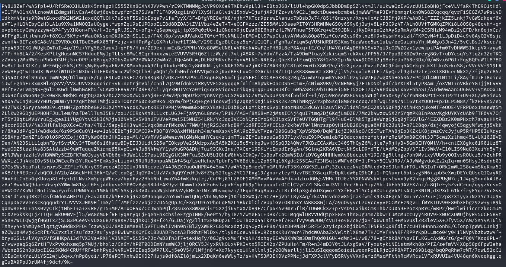
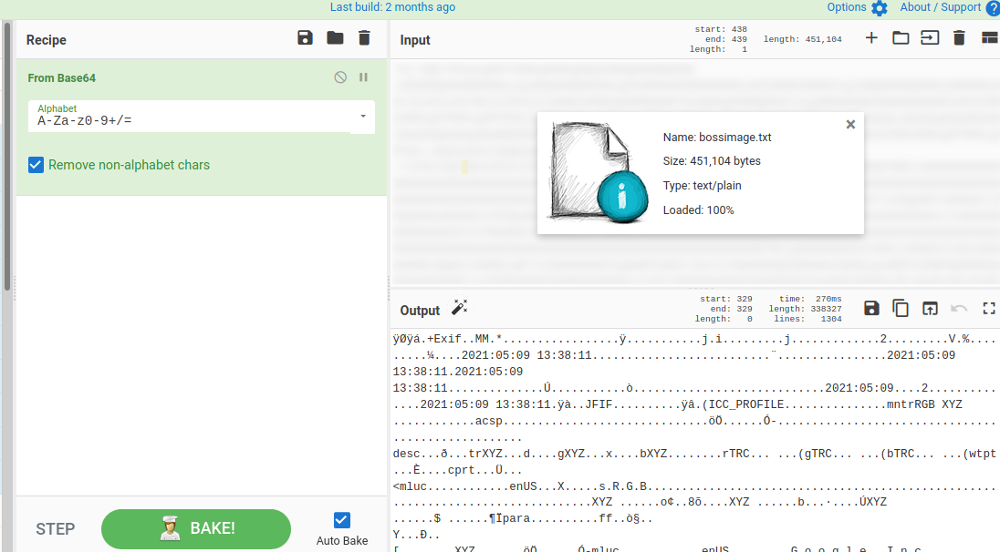
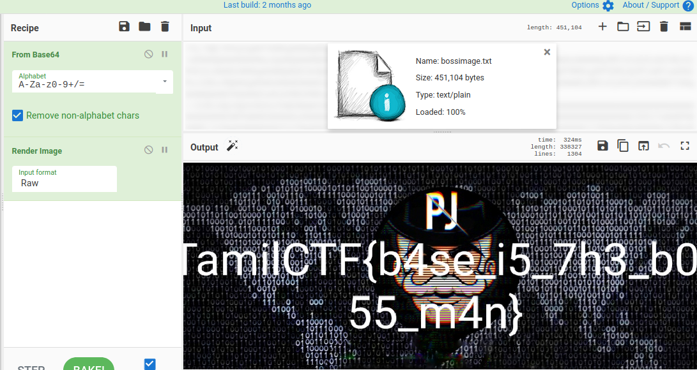

# Boss Image



Here we get base64 encoded text file.



I used [CyberChef](https://gchq.github.io/CyberChef/). there is a file upload option, and decoded from base64



Its show a Image file, So i go for `Render Image` option on cyberchef. we will get the flag there.



```flag = TamilCTF{b4se_i5_7h3_b055_m4n}```
