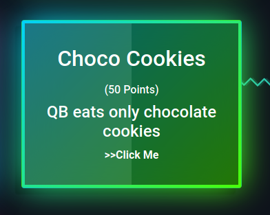
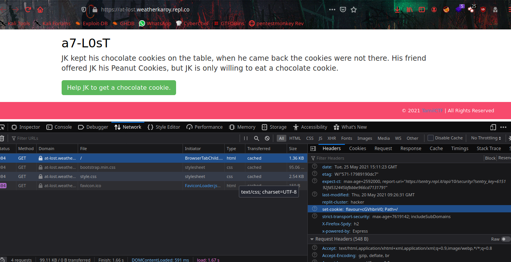
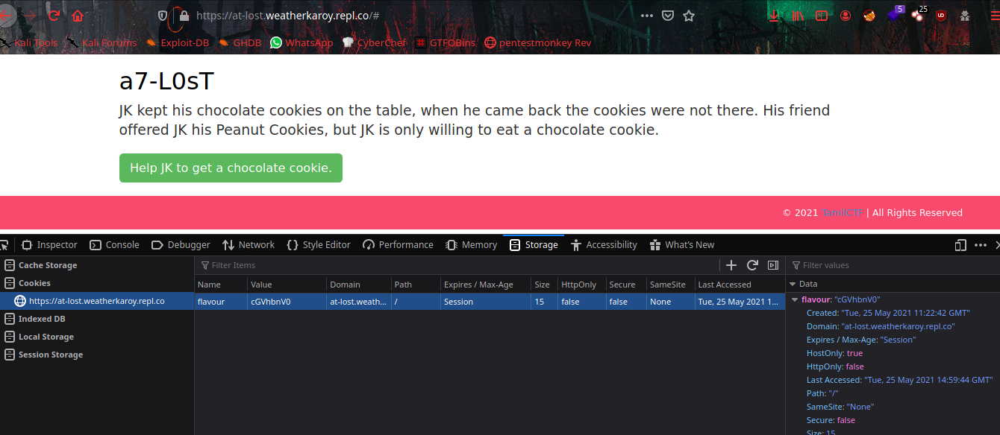
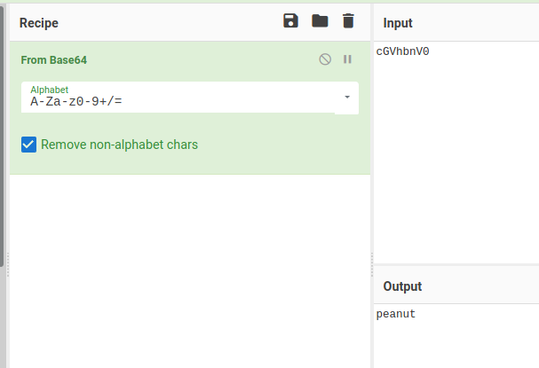
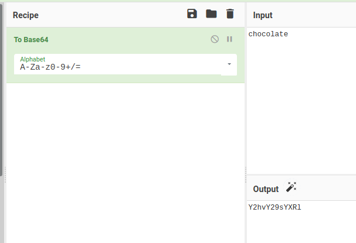
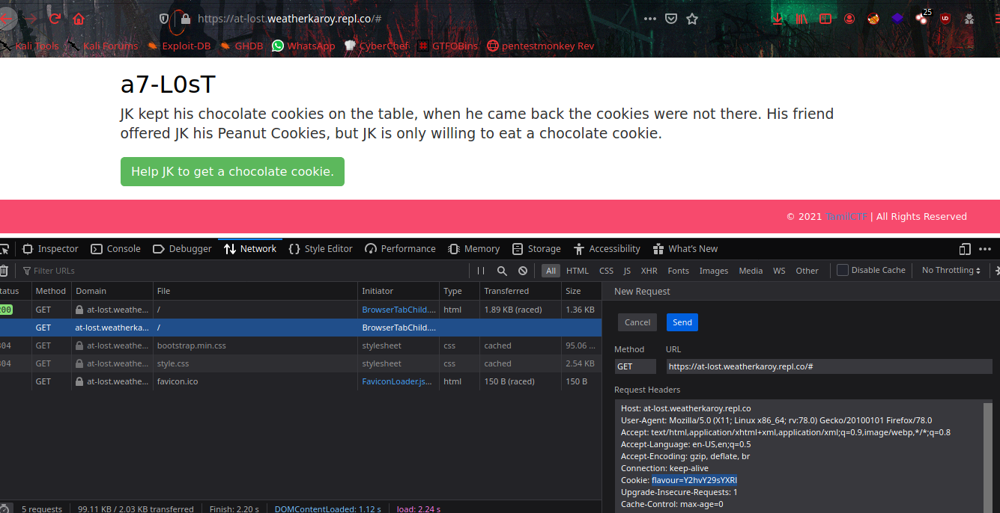
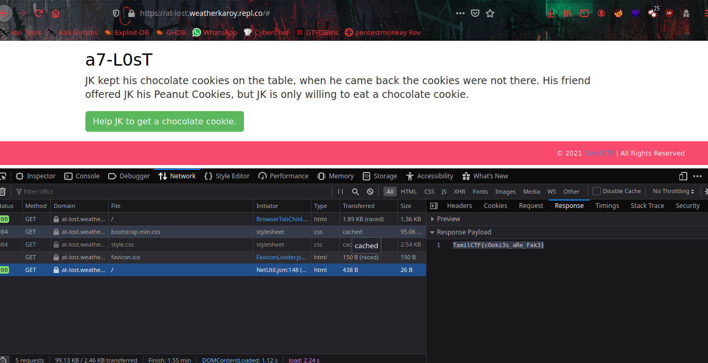

# Choco Cookies



From the challenge name we know that it is something about `Cookie:` header.



From the webpage there is base64 encoded cookie value is storing flavour as name.



Once we decode it we get `peanut`. 



From the Main webpage there is a hint `JK is only willing to eat a chocolate cookie` So let's encode `chocolate` to base64.



Then let's edit the Cookie value to base64 encoded string of chocolate.
`Cookie: flavour=Y2hvY29sYXRl` and resend the request.



After this we can get the flag in the `Responce Tab` of Browser's `Network Monitor`.



```flag = TamilCTF{cOoki3s_aRe_Fak3}```
