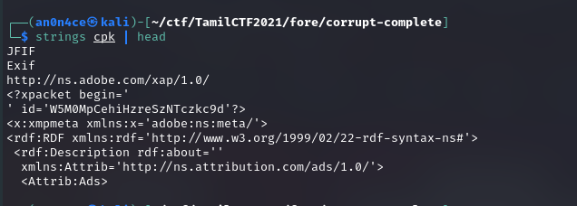
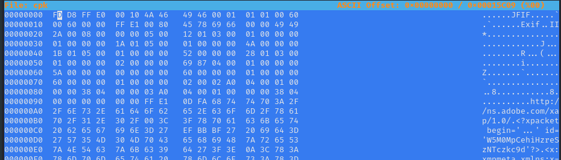
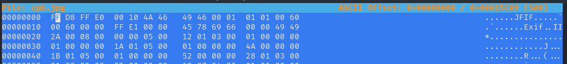
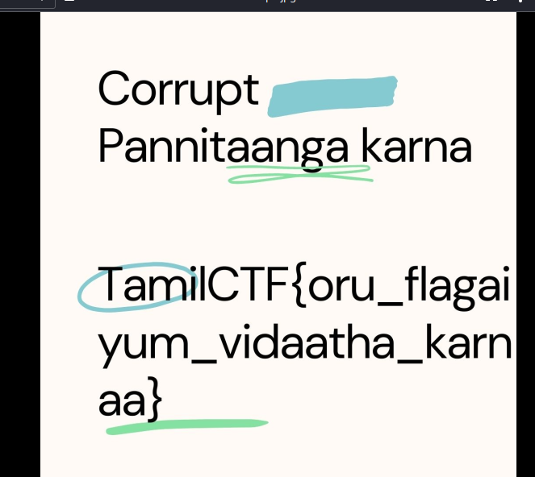

# Corrupt Pannitaanga Karna


We will get a data file called `cpk`, when we looking the `strings` of the file it give its a `JFIF` file, a image file.



let's check hex with `hexeditor`,



Magic header of file is wrong here, let's correct it with right magic header of jpg `FF D8 FF E0 00` and save and exit.



From the image we saved, we will get our flag.



```flag = TamilCTF{oru_flagaiyum_vidaatha_karnaa}```
