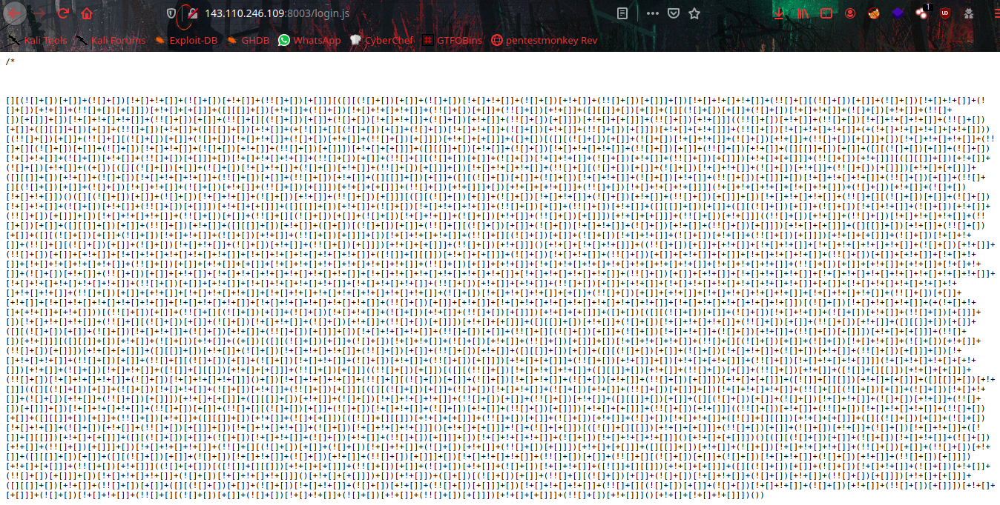

# CringeJS


When we looking in the webpage there is a login portal, we don't have any credentials to login in.


So i go for `Forgot Password` section and got an interesting JS file.



It's JSFuck language,  it to get the flag.


```flag = TamilCTF{Jav4_5cr1p7_s0ck5}```
