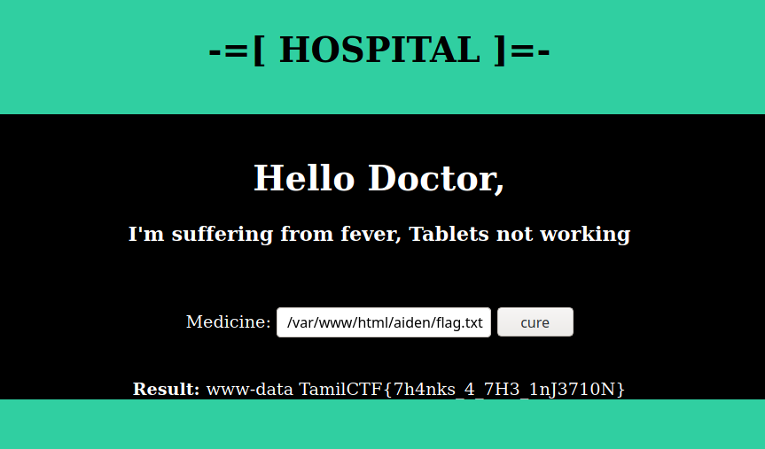

# Cure Me


In the webpage there is a input column and cure button.


When put a term and Command, i.e `med ;whoami`. it gives current user name!


So the challenge has `Command Injection` vulnerability. looking further more Directories and files, we get flag.txt from `/var/www/html/aiden/flag.txt`



```flag = TamilCTF{7h4nks_4_7H3_1nJ3710N}```
