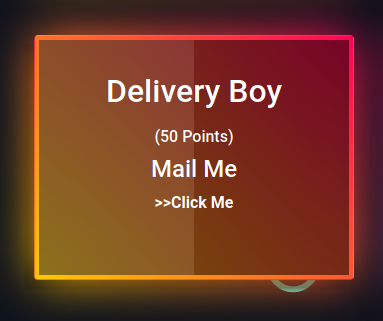
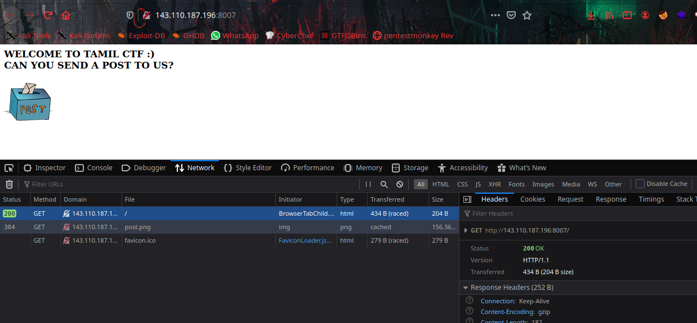
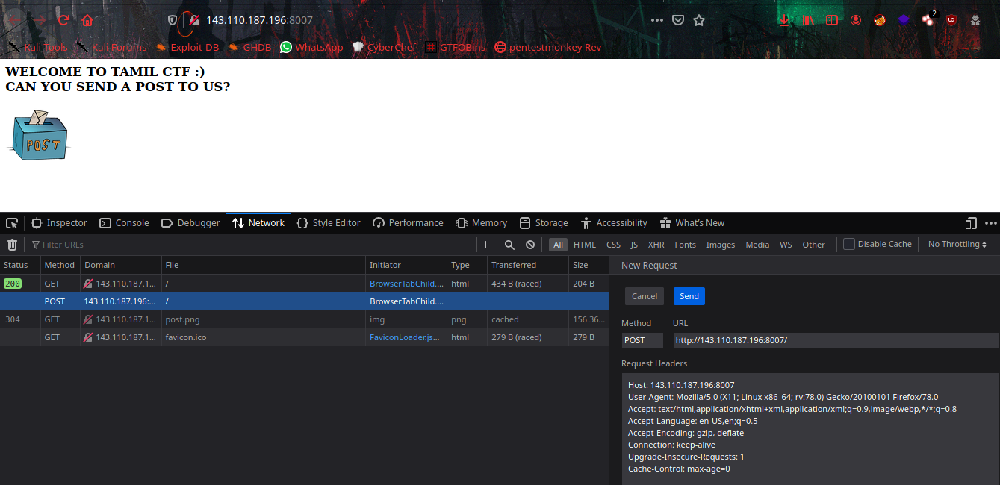
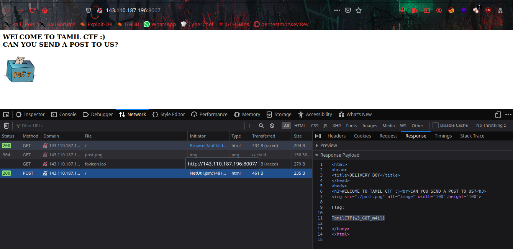

# Delivery Boy



In the webpage we can see saying about a hint `Can You Send A POST to Us?`.



The request is `GET` method here, let's edit the packet and send a `POST` request using browser `Network Monitor`.



In the `Responce Tab` we can get the flag.



```flag = TamilCTF{w3_G0T_m4il}```
