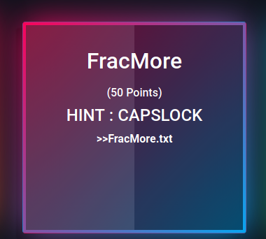
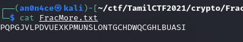

# FracMore



From the name of the challenge, we get its a `Fractionated Morse Cipher`.



So [decode](https://www.dcode.fr/fractionated-morse) to get the flag.


```flag = TamilCTF{NEWTYPEOFMORSECODEIGUESS}```
