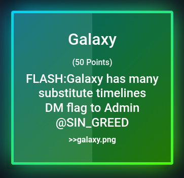
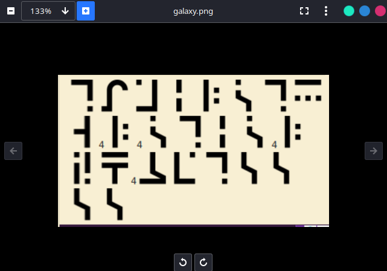
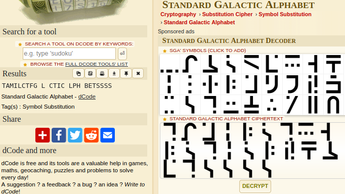

# Galaxy



It's Standard Galactic Alphabet.



So [decode](https://www.dcode.fr/standard-galactic-alphabet) it and follow the instructions of admin to get the flag.



```flag = TamilCTF{G4l4ctic_4lph4betssss!!}```
