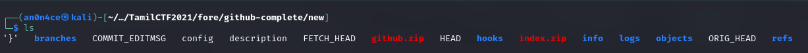
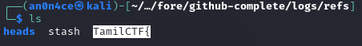
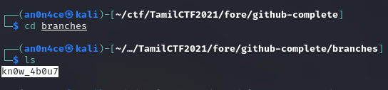
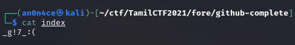

# GitHub


Here we get Zip Archived data of Github Repo.



What i did here, i go through all directories and files, I came across flag has different parts. Actually it's 4 part, first part of the flag will inside `/logs/refs`



And 2nd part is on `/logs/refs/heads/`


3rd part is on `/branches`



4th part is on `index.zip` file. It is password protected file, there is a `config` file you will get password from there.



Finally get all part together to get the flag.

```flag = TamilCTF{i_d0nt_kn0w_4b0u7_g!7_:(}```
