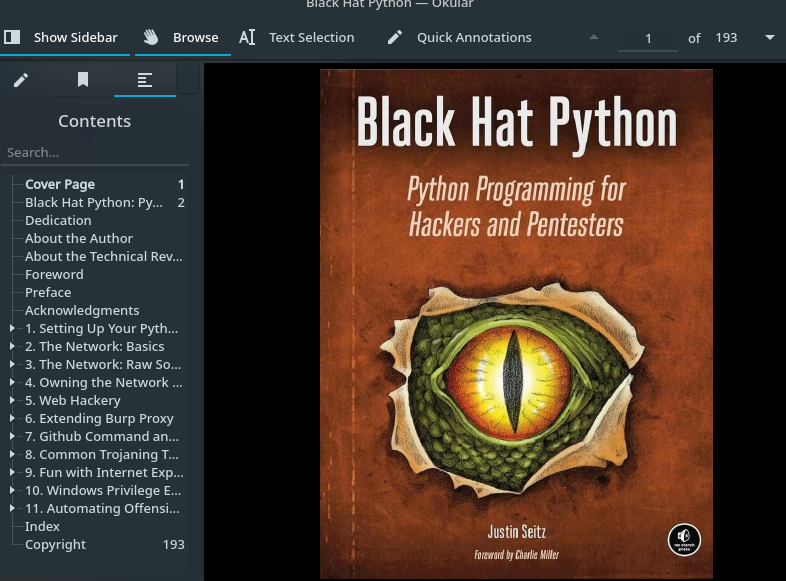
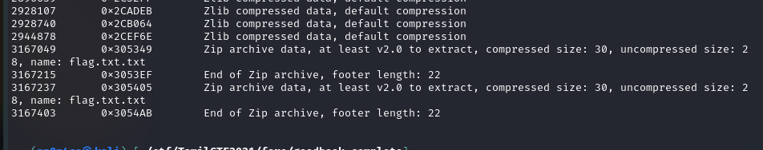
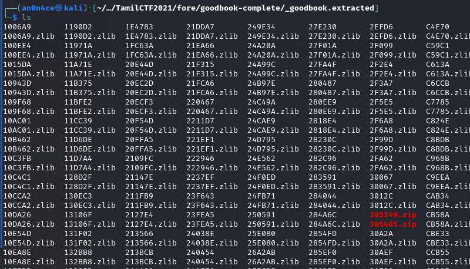

# GoodBook


Here we get pdf file of book named `Black Hat Python`.



Nothing got from there, when we do `binwalk`, we get lots of file and at the bottom it has `Zip Archived file`.



Let's extract it with `binwalk -e goodbook` command. and list out the files



Extract the Zip Archived file to get `flag.txt`.


```flag = TamilCTF{3xtr4cti0n_is_n0n3}```
