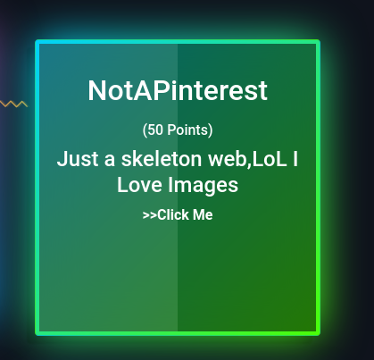
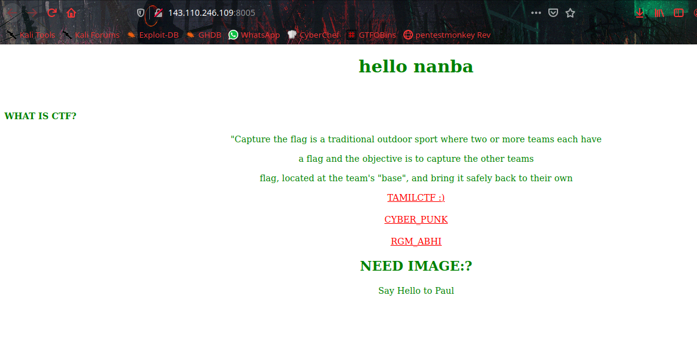
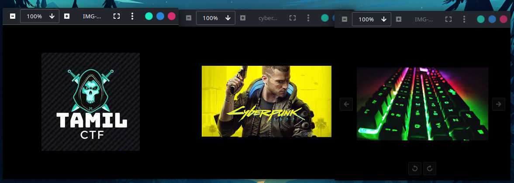
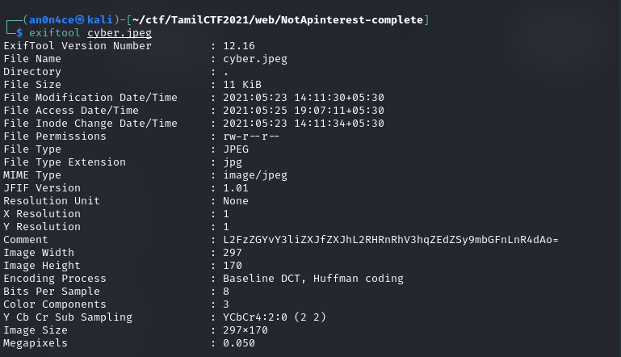
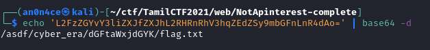
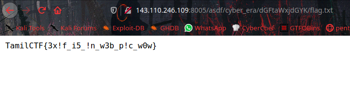

# NotAPinterest



In the webpage we can download the 3 picture using the given link.




When we looking Exif-metadata of `cyber.jpeg` with `exiftool`.



We will get base64 encoded string, let's decode it.



It's a path to get `flag.txt` file, let's open with browser.



```flag = TamilCTF{3x!f_i5_!n_w3b_p!c_w0w}```
