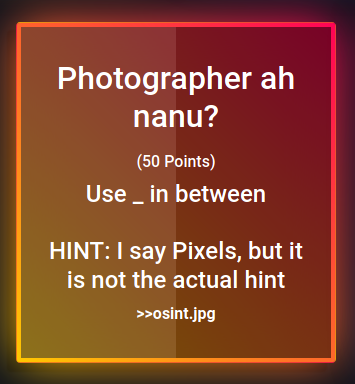
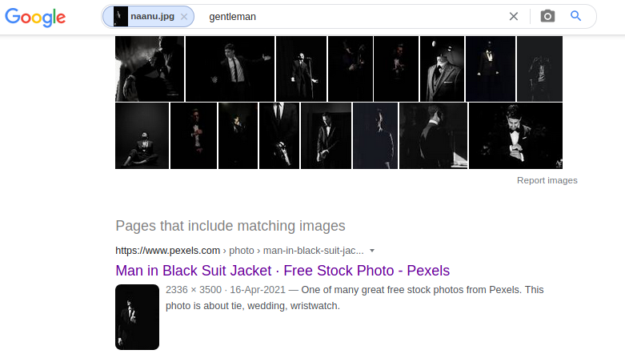
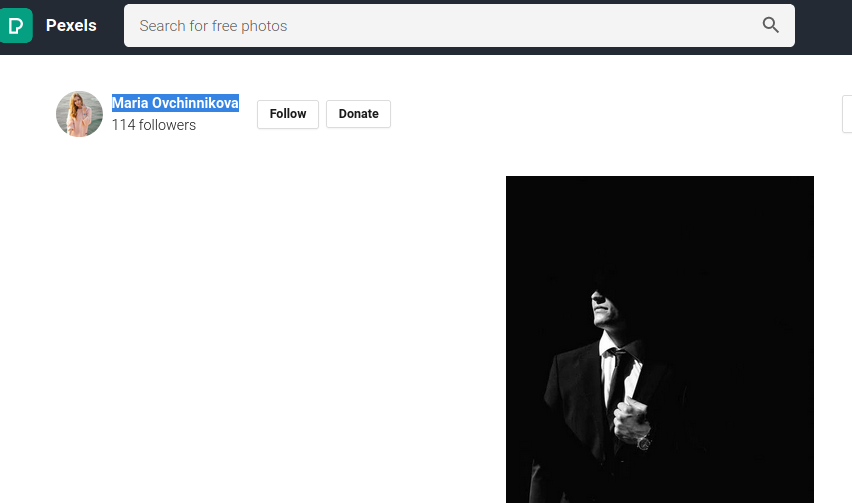

# Photographer ah nanu?



We get an Image file here, I go for `Google Image` search.



From the First [Link](https://www.pexels.com/photo/man-in-black-suit-jacket-7532775/) We got the name of the Photographer. It is the flag.



```flag = TamilCTF{Maria_Ovchinnikova}```
