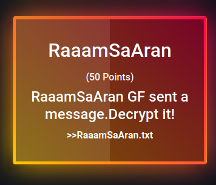
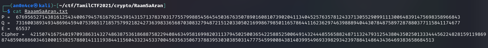
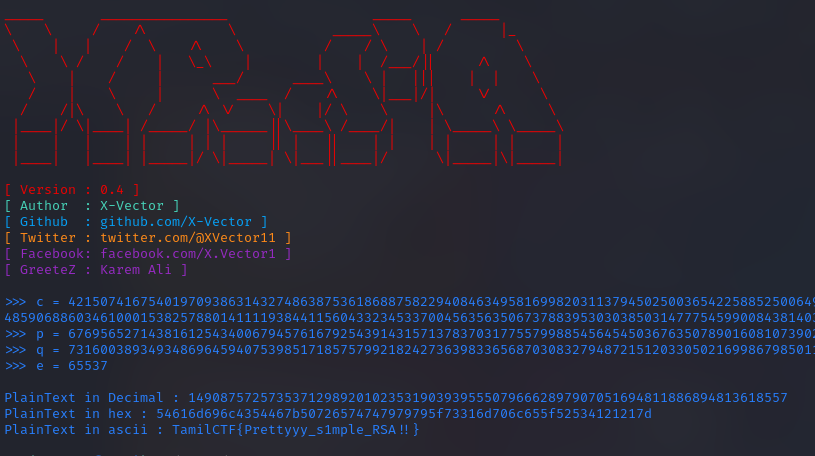

# RaaamSaAran



From the challenge name we know, it's `RSA` decryption.



Here i used [X-RSA](https://github.com/X-Vector/X-RSA) tool to decrypt, and get the flag.



```flag = TamilCTF{Prettyyy_s1mple_RSA!!}```
