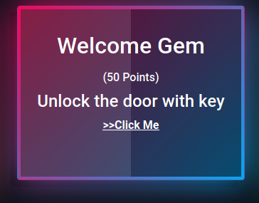
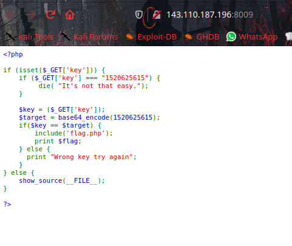
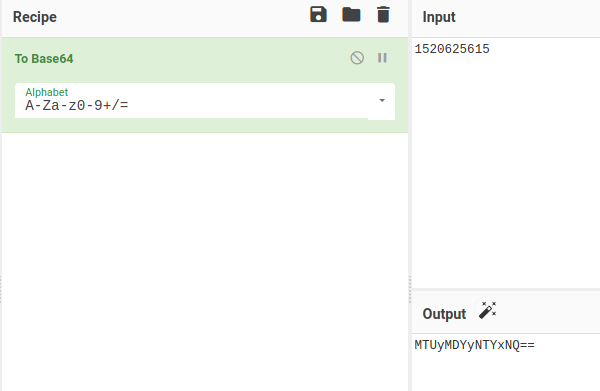
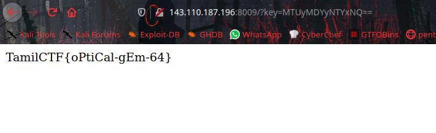

# Welcome Gem



In the webpage we can see php source code.



From this php code we can understand about `key=` parameter and that key will be base64 encoded string of `1520625615`.



let's open the browser and put the url `http://143.110.187.196:8009/?key=MTUyMDYyNTYxNQ==` to get the flag.



```flag = TamilCTF{oPtiCal-gEm-64}```
