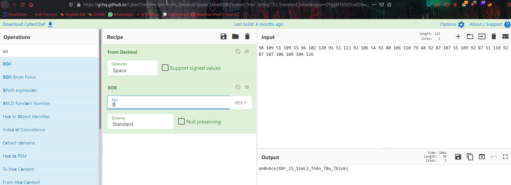

# Hax00r


### Challenge;
```
98 109 51 109 55 96 102 120 91 51 113 92 106 54 92 80 106 110 79 48 92 87 107 55 109 92 87 51 118 92 87 107 106 109 104 126
```

From the name of the challenge we know that it's a `XOR` challenge, but here we have `Decimal` values, lets decode it first.
Here is i used [CyberChef](https://gchq.github.io/CyberChef/) to decode.


We already know it's a `XOR` now we need a key to decrypt it. From the hint we will get key to decrypt.

The hint is `" There are 3 types of hackers [ BlackHat | WhiteHat | GreyHat ] "`

So key will be `3`



Or you can simply Brute Force `XOR` key to get flag like this, 


```an0n4ce{X0r_i5_SimL3_Th4n_T0u_Think}```
