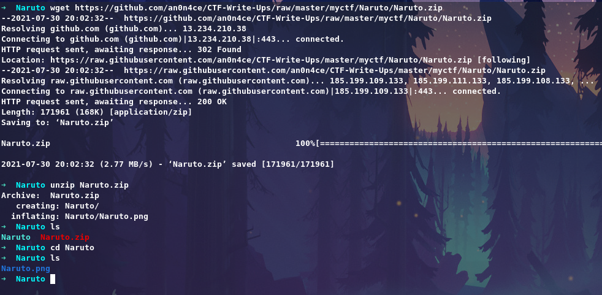

# Believe It


Get Challenge [Here](https://github.com/an0n4ce/CTF-Write-Ups/raw/master/myctf/Naruto/Naruto.zip)

Get file using `wget` command and extract it.



From the description of challenge they are saying about `MAGIC`, So the challenge maybe about `Magic Bytes` also known as `File Signature` also a forensic category challenge.
Let's look at it.


It's a corrupted picture. Let's check with `file` command.
```bash
file Naruto.png
```


So the file is `JPEG` image, but here extention is `png` let's rename it with `mv` command.
```bash
mv Naruto.png Naruto.jpg
```

Still Corrupted image, let's check `Magic Bytes` of the file with `hexeditor` and correct it.
```bash
hexeditor Naruto.jpg
```


You can check [List of File Signatures](https://en.wikipedia.org/wiki/List_of_file_signatures) here.


Let's take a look at `JPEG` file signature, that is `FF D8 FF E0 00 10 4A 46 49 46 00 01`


So here is wrong hex signature where i marked let's correct it, Put `00 10 4A 46` insted of `0D 0A 1A 0A` and save the image using `ctrl + x`.


Let's look at the image now.


We got our image. There is encypted flag on the picture. Now we need to utilize the hint to get flag.

Hint : `When i was downloading episode 301, TOR send me the download request 47 times repeatably. I don't know whats's going on.`

They are saying TOR send me request 47 times, what interesting part is here once we Mirror the word `TOR` it will be `ROT` and they are saying about `47` times.
So the encryption is `ROT 47`.

Let's decrypt ` 2?_?c46LJ@F0=62C?65023@FE0>28:403JE6DN ` the flag with `ROT 47`.


``` an0n4ce{you_learned_about_magic_bytes} ```

### Thank you for reading my writeup!
