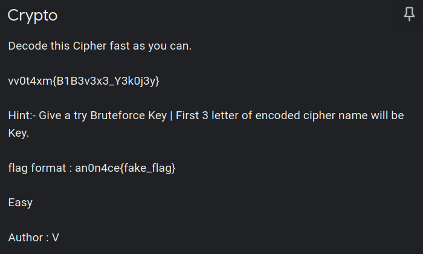
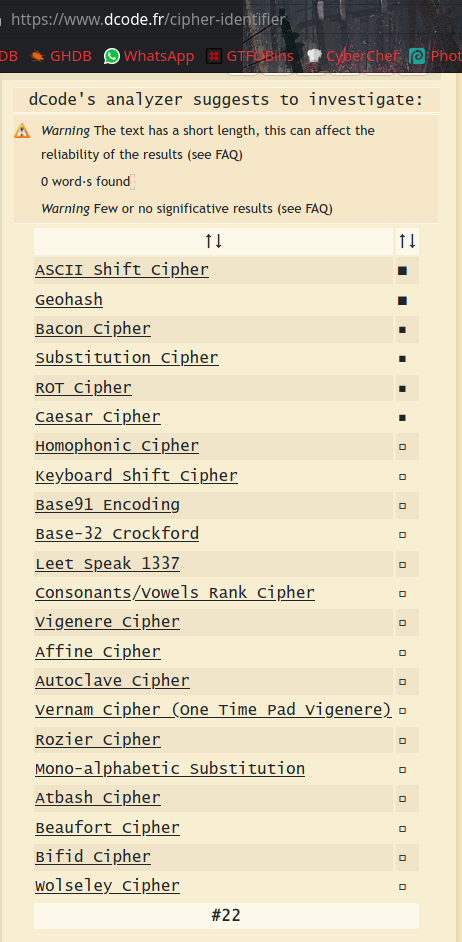
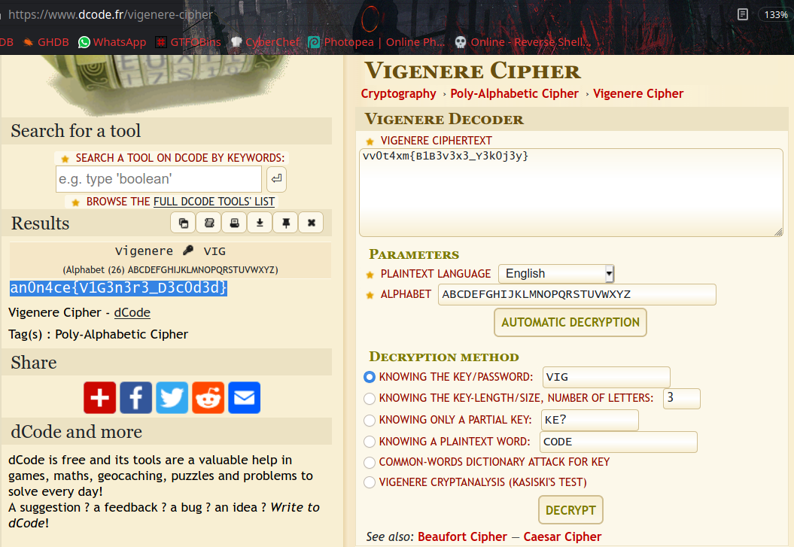

# Vigenere



### Challenge:
```
vv0t4xm{B1B3v3x3_Y3k0j3y}
```

It's an encoded cipher, we can use [cipher-identifier](https://www.dcode.fr/cipher-identifier) to analize what encoding it is.



These are all possibilities, we need to look one by one. From given hints we can go more straight forward, 

They said `" First 3 letter of encoded cipher name will be Key " ` and Author name looks like kind a interesting.. `V`

So we need to find which encoding uses a `KEY` to decode, from the cipher-identifier list.

There is only one cipher name we found before, Starting with letter `V`, So we can go for it First `Vigenere Cipher`.

As per the hint given, if it `Vigenere Cipher` then key will be `VIG` or `vig`, Let's take a look.



Set Decryption Method to `KNOWING THE KEY/PASSWORD:` and put our key `VIG` you will get the flag.

```
an0n4ce{V1G3n3r3_D3c0d3d}
```
